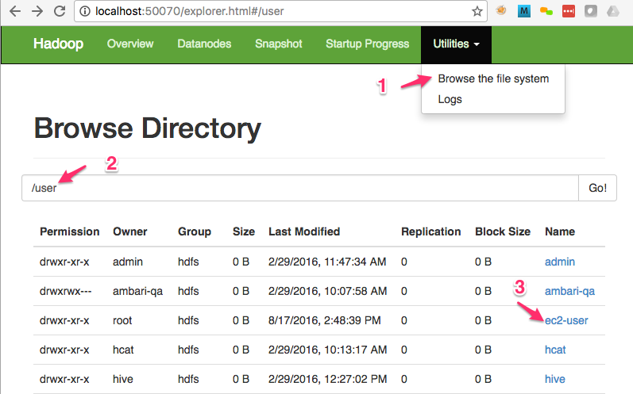

<link rel='stylesheet' href='../assets/css/main.css'/>
[Main Index](../README.md)

-----

# Lab : HDFS-1 : HDFS Intro

## Lab Objectives:
- Understand how to view the contents of HDFS
- Learn how to perform basic file manipulation of your HDFS.
- Add some files to a directory to prepare for the next exercise.

## Notes
Replace `MY_NAME` appropriately throughout the lab

## STEP 1: View HDFS files in the browser UI



* Go to Namenode UI and launch the file browser
(look under Utilities menu -> "Browse The File System" )
* Navigate to    `/user/<login name>`  directory in HDFS

**=> Q : What files do you see?**  
**=> Q : How about all the personal workspace files we created in 'getting started' lab?**

### Break : Instructor to explain the missing files ###


## STEP 2: Use command line utility view files in HDFS

Hint : To find usage of a hadoop command, just type the command in terminal.  It will print out the usage:
```bash
    $   hdfs
    $   hdfs dfs
```

**=> Ok, let's list the files in HDFS root directory.**

That would be the / directory.

If you do have some data, you will see something like this, with the
following as a sample.

```console
    Found 2 items
    drwxr-xr-x   - hduser supergroup          0 2013-02-19 12:00 /user
    drwxrwxrwx   - hduser supergroup          0 2013-02-19 12:00 /tmp
```
Otherwise if you have no files you will see nothing.


## STEP 3: View all files
Browse the various directories at the root level.


## STEP 4: Create your home directory in HDFS

This cannot be done in the Namenode UI; it can be done in Command Line (CLI) or Ambari views.

```bash
    $     hdfs   dfs   -mkdir  MY_NAME
```

This directory will be located in `/user/<login_name>/MY_NAME`


## STEP 5: Copying files to HDFS from your PC.
Copying a file into HDFS.

```bash

     $  hdfs  dfs  -put /etc/hosts   MY_NAME/

```


## STEP 6: View the created files in Browser UI  (refer to STEP 1)
Go ahead and click  on a file in the UI.  What do you see?


## STEP 7: Overwrite files in HDFS

Go ahead and try to overwrite the same file (same name).

```bash

     $  hdfs  dfs  -put  /etc/hosts   MY_NAME/

```

What is the result?  why?

**=> Q :  How can we over-write the file?**  
    You have to delete it and re-create it

**=> Delete the 'hosts' file in HDFS**  

Once you deleted the HDFS file, copy it again.  

## STEP 8: Inspect files in HDFS

```bash

    $   hdfs dfs  -cat   MY_NAME/hosts
```


## STEP 9: Get files out of HDFS

```bash
    $  hdfs dfs  -get   MY_NAME/hosts  hosts-local.txt
```

## Deeper dive into HDFS

### STEP 10: Create a zero sized file

Replace MY_NAME with yours.

    $  hdfs dfs  -touchz  MY_NAME/z
Verify the file has zero length. Replace MY_NAME with yours.

    $  hdfs dfs  -ls MY_NAME
*=> Q : How many blocks does file z have?*

### BONUS 1: List all the data nodes using hdfs command.

Hint 1: Find the right 'sub command' for hdfs.
Hint 2 : you may lack permissions. Try the command with:

    sudo -u hdfs   the-command

### BONUS 2: Block locations

Find out which machine has the blocks for a particular file.
Hint fsck

        $  hdfs fsck   <full file name> [options]

Can you figure out the options?
HINT: You probably need to do this as the hdfs user.
