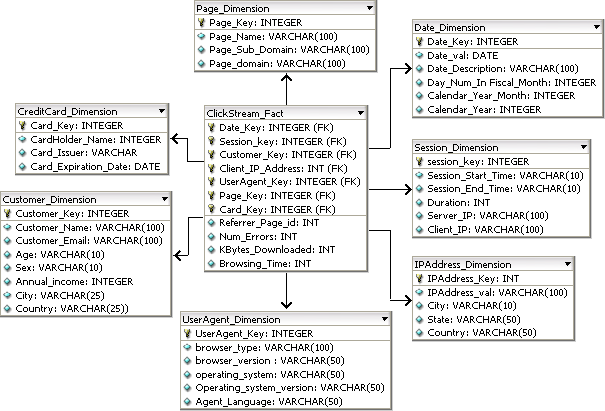

[<< back to main index](../README.md)

# Star Schema

### Overview

Hive is often set up as a data warehouse.  But can hive take an existing data warehouse star schema?

We are going to take our clickstream example and imagine that
it is already divided up as a star Schema.

### Builds on
Nothing

### Working directory
`hadoop-adv-labs/3-hive/3.4-schema`

### Files
`big-data-with-sql-101/star-schema/copy_file_to_hdfs.sh`   
`big-data-with-sql-101/create_table.sql`

-----------------------
ERD for source data
-----------------------

 

Note that we are not using all of the tables in the ERD.

-----------------------
Step 0: Ensure your database exists
-----------------------

First, make sure your database (your name) exists. You should have done this already.
Try to say USE MY_NAME_db;  If that doesn't work, then CREATE DATABASE MY_NAME_db;

-----------------------
Step 1: Load data into HDFS
-----------------------

Now, let's edit the file to load into hdfs.

Edit file : `copy-files-to-hdfs.sh`.  

**TODO: Fix the TODO items**

Hint : 
- Use a text editor's 'replace' option to change MY_NAME_db  & LOGIN_NAME appropriately. 
- In vim do `:1,$s/MY_NAME_db/your name/g`

Run the script as follows.

**TODO: Run this at the bash prompt**

```bash
    $   sh ./copy_files_to_hdfs.sh
```
 
-----------------------
Step 2: Create Hive External Tables 
----------------------- 
Edit the file `create-tables.sql`.  

You will need to edit the USE MY_NAME_db; at the beginning

Change
```sql
	USE MY_NAME_db;
```

To

```
	USE <write your name here e.g., tim_db>;
```

Then, run the file with hive -f to create htables

   ```
   $ hive -f create-tables.sql

   ```

------------------------------
Step 3: Examine Table contents
-------------------------------

When you start hive, be sure you selet your database (i.e, your name)

Then, we can examine the table contents.

   ```sql
   	hive> 
          USE MY_NAME_db; --TODO: Change This
	      select * from ClickStream_Fact;
   ```

The results:
```console
	1	4	9	4	1	3	4	0	10	5
	2	2	8	3	3	6	5	1	400	3
	3	3	3	1	8	9	1	0	20	2
	4	1	1	4	1	1	4	0	1000	1
	5	2	3	6	3	2	4	0	2	3
	6	5	5	1	2	3	1	0	3	2
	7	5	7	2	9	1	9	0	4	8
	8	3	8	3	1	4	8	0	50	7
	9	1	9	5	4	4	9	0	60	1
	10	2	1	6	5	4	10	0	70	6

```

Oops, what did you see?  Yes, the fact table is nearly entirely made up of foreign keys. Not very useful.

What was the schema again?

```console
	hive> 
        describe ClickStream_Fact;
		    date_key            	int
		    session_key         	int
		    customer_key        	int
		    ipaddress_key       	int
		    useragent_key       	int
		    page_key            	int
		    referrer_page_id    	int
		    num_errors          	int
		    kbytes_downloaded   	int
		    browsing_time       	int   
```

Only the last 3 columns are data -- the rest are foreign keys.


----------------------------------
Step 4: Develop a Denormalized View of the Fact Table
----------------------------------

Create a view of the fact table that brings in all the dimensions.  Hive has a keyword "CREATE VIEW".

**TODO: Enter the Folowing at the hive prompt:**

```sql
    hive> 
	      USE MY_NAME_db; --TODO: Change this

	      CREATE VIEW ClickStream_AllDimensions AS
	      SELECT  
        	      a.referrer_page_id, a.num_errors, a.kbytes_downloaded, a.browsing_time, 
         	      b.date_ts, b.date_val, b.date_description, b.calendar_month_number_in_year, 
                  b.calendar_day, b.calendar_year, 
         	      c.session_num, c.session_start_time, c.session_end_time, c.duration, 
         	      d.customer_name, d.customer_email, d.sex, d.annual_income, d.city as customer_city, 
                  d.state as customer_state, d.country as customer_country, 
         	      f.ipaddress_val, f.city as ip_city, f.state as ip_state, 
         	      g.page_name, g.page_sub_domain, g.page_domain, 
         	      h.browser_name, h.browser_version, h.operating_system, h.agent_language
	      FROM    ClickStream_Fact A,
         	      ClickStream_Date_Dimension B,
         	      ClickStream_Session_Dimension C,
         	      ClickStream_Customer_Dimension D,
         	      ClickStream_IPAddress_Dimension F,
         	      ClickStream_Page_Dimension G,
         	      ClickStream_UserAgent_Dimension H
	      WHERE   A.Date_Key = B.Date_Key
         	      AND A.Customer_Key = D.Customer_Key
         	      AND A.Session_Key = C.Session_Key
         	      AND A.IPAddress_Key = F.IPAddress_Key
         	      AND A.Page_Key = G.Page_Key
         	      AND A.UserAgent_Key = H.UserAgent_Key;
```

Now try to SELECT from the view.

**TODO: Enter this at the hive prompt**

```sql
    hive> 
	      SELECT * FROM ClickStream_AllDimensions;
```

Notice that it creates a MapReduce job. This is what a view doew.

Perhaps you want to save it to a table.

**TODO: Modify the View to save it to an actual table called ClickStream_Fact_Denorm**

----------------------------------
Step 5: Number of users accessing web server from a given server IP per day? 
----------------------------------

This helps us analyze whether any particular server is clogging the network or is involved in malicious attack.

In your query show the top few IP addresses


**TODO: Write the query for Number of users accessing web server from a given server IP per day**


----------------------------------
Step 6: Which client IP is generating excessively large hits?
----------------------------------

Show the top few client IP addresses by hits.

**TODO: Write the query for Which client IP is generating excessively large hits?**

----------------------------------
Step 7: Which customer (Client_IP) address is downloading huge amounts of Data?
----------------------------------

Show the top few customers downloading data

**TODO: Write the query for which customer (Client_IP) address is downloading huge amounts of Data?**

----------------------------------
BONUS: Denormalize Date Dimension
----------------------------------

Remember we said that date dimensions are pretty useless in Hive?  How would you denormalize the
date dimension into the fact table (go ahead and create a whole new table).

----------------------------------
BONUS QUERIES: 
----------------------------------
* Which customer is coming from more then one client IP?
* Which customer is creating large number of sessions per day?
* On which page do users stay for maximum duration?

[<< back to main index](../README.md)
