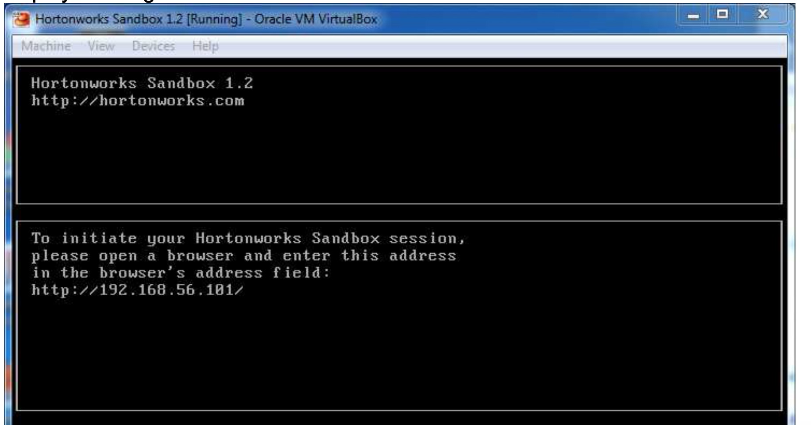

<link rel='stylesheet' href='assets/css/main.css'/>

# Setup Student : Setting Up Personal Workspace


## Prerequisites


Prerequisites
To use the Hortonworks Sandbox on Windows you must have the following resources available to you:
 *  Hosts:
   - A 64-bit machine with a chip that supports virtualization. Not all 64-
bit chips have this capability. Check your system documentation or your IT department. For more information, see this Microsoft article: http://windows.microsoft.com/en-us/windows7/32-bit-and- 64-bit-windows-frequently-asked-questions
   -  A BIOS that has been set to enable virtualization support. This is usually already set, but in some cases must be set manually. Check your system documentation or your IT department. For more information, see this Microsoft article: http://www.microsoft.com/windows/virtual-pc/support/configure- bios.aspx
 


--------

## STEP 1: Download the Cloudera Hortonworks HDP Sandbox

You will need to install Oracle Virtualbox if you have not done so already.

Download the HDP sandbox here.  (for Virtualbox)

[HDP Sandbox VM](https://www.cloudera.com/downloads/hortonworks-sandbox/hdp.html)

Open virtualbox and say "Import Appliance"

Then load the `.OVA` file into your virtualbox.

Then you can start the Appliacne


## STEP 2: Connect to the VM (Oracle Virtualbox)

You will need to install Oracle Virtualbox if you have not done so already.

When you run the appliance you should see a screen as follows



You can log in using `ALT-F5`. The login is `root` and the password is `hadoop`

This should get you to the prompt.

### Step 3: Connect to the VM (Putty)

You also can connect to the VM using putty (windows), or terminal (MacOS).

Windows users can download putty from http://www.putty.org/

You can then connect to the VM using the IP address identified in Step 2. The port should be 2222 (the default is usually 22).
Login is root, password is `hadoop`.


## STEP 4:  Make a personal workspace in Linux
After you login
```bash
        $  cd    # get to home dir
        $  mkdir   MY_NAME
        $  cd    ~/MY_NAME     #   <-- this is your personal space
```


## STEP 5:  Copy labs


``` bash
    $  git clone git@github.com:elephantscale/big-data-with-sql-101.git
    $  cd  ~/big-data-with-sql-101/scripts

    $  ./setup-data.sh
```


